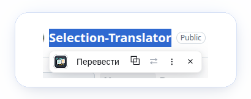

# Selection Translator

Selection Translator — компактное расширение для Chromium-браузеров, которое переводит выделенный текст прямо на странице. Выделите фрагмент, нажмите `Перевести` или `Скопировать` — результат появится в аккуратной плавающей панели без перехода на отдельный сайт.

<p align="center">
  
</p>

Проект сделан как Manifest V3-расширение и подходит для Chrome, Yandex Browser и других Chromium-браузеров, которые поддерживают нужные API расширений.

## Возможности

- Плавающая панель действий рядом с выделенным текстом.
- Перевод в небольшом окне со скроллом для длинных фрагментов.
- Копирование исходного текста и готового перевода.
- Нативное контекстное меню браузера для выделенного текста.
- Настройки провайдера, языка перевода, лимита символов и поведения панели.
- Поддержка Google web, Yandex Cloud Translate и эндпоинта, совместимого с LibreTranslate.
- Устойчивость к ограничению доступа со стороны Google: цепочка адресов, кэш, паузы и переход на второго провайдера.

## Как выглядит рабочий сценарий

1. Выделите текст на любой обычной веб-странице.
2. Нажмите `Перевести` в плавающей панели.
3. Проверьте перевод в небольшом окне рядом с выделением.
4. Скопируйте исходный текст или перевод одной кнопкой.
5. При необходимости поменяйте провайдера и язык в настройках расширения.

## Установка для разработки

1. Склонируйте репозиторий.
2. Установите зависимости: `npm ci`.
3. Соберите расширение: `npm run build`.
4. Откройте в браузере страницу `chrome://extensions`.
5. Включите режим разработчика.
6. Нажмите `Загрузить распакованное расширение`.
7. Выберите папку `dist/`.

После изменений в TypeScript-коде или `manifest.json` запустите `npm run build` и перезагрузите расширение на странице расширений.

## Команды

| Команда | Что делает |
| --- | --- |
| `npm run typecheck` | Проверяет TypeScript в строгом режиме без записи файлов |
| `npm test` | Запускает тесты через встроенный Node.js test runner и `tsx` |
| `npm run build` | Собирает рабочее Manifest V3-расширение в `dist/` |
| `npm run verify` | Запускает typecheck, тесты и сборку |
| `npm run pack` | Собирает zip-архив расширения из `dist/` в `outputs/` |

Готовый архив появляется здесь:

```text
outputs/selection-translator-extension.zip
```

Папки `dist/` и `outputs/` не версионируются.

## CI/CD

В репозитории настроены два процесса.

### CI

CI запускается на pull request, push в `main` и вручную через GitHub Actions. Он:

- запускает `npm run verify`;
- проверяет, что расширение собирается через `npm run pack`.

### CD

CD запускается только при отправке git-тега версии, например `v1.0.0` или `v1.0`.

Перед публикацией релиза CD-процесс:

- приводит короткий тег вида `v1.0` к версии `1.0.0`;
- сверяет версию тега с `version` в `package.json`;
- сверяет версию тега с `version` в `manifest.json`;
- запускает проверки;
- собирает zip-архив;
- публикует GitHub Release с архивом расширения.

Пример релиза:

```bash
git tag v1.0.0
git push origin v1.0.0
```

Если номер тега не совпадает с версиями в `package.json` и `manifest.json`, релиз остановится.

## Структура проекта

| Путь | Назначение |
| --- | --- |
| `manifest.json` | Конфигурация Manifest V3 расширения, указывает на JS-файлы в собранном `dist/` |
| `src/` | TypeScript-код content script, background service worker, настроек и переводчиков |
| `popup/` | Popup расширения: HTML/CSS и TypeScript entrypoint |
| `options/` | Страница настроек: HTML/CSS и TypeScript entrypoint |
| `assets/` | Иконки расширения |
| `scripts/` | Сборка TypeScript-исходников в рабочий `dist/` |
| `tests/` | Тесты manifest, UI-скриптов, настроек и переводчиков |
| `.github/workflows/` | CI и CD сценарии GitHub Actions |

## Провайдеры перевода

Расширение умеет работать с несколькими провайдерами:

- Google web;
- Yandex Cloud Translate;
- эндпоинт, совместимый с LibreTranslate.

Для провайдеров, которым нужны ключи или собственный эндпоинт, значения задаются в настройках расширения и не хранятся в репозитории.

## Устойчивость Google-провайдера

Google web работает без ключа, поэтому доступ ограничивается по IP-адресу и отвечает 429 со страницей «Sorry... automated queries». Чтобы перевод не падал, расширение делает так:

- запрос идет по цепочке из трех адресов Google, начиная с `clients5.google.com` с клиентом `dict-chrome-ex`, который отвечает даже там, где `translate.googleapis.com` уже отдает 429;
- текст уходит в теле POST-запроса, а не в URL: длинный GET-адрес Google отклоняет с ошибкой 400 примерно от 2500 знаков кириллицы;
- запросы разнесены по времени с джиттером, а после 429 включается пауза, вместо повторного долбления адреса;
- переводы кэшируются на 30 минут, одинаковые параллельные запросы склеиваются в один;
- если Google ограничил доступ, а в настройках есть ключ Yandex Cloud или собственный эндпоинт, перевод автоматически уходит туда. Отключается галочкой «Если Google ограничил доступ, переводить через Yandex или свой endpoint».

Заголовки `User-Agent` и `Referer` расширение не подменяет: `fetch` их запрещает, а `declarativeNetRequest` потребовал бы лишних разрешений.

## Обновление до 1.2.0

Версия 1.2.0 переводит Google-провайдера на цепочку адресов и POST-запросы, добавляет кэш, паузы после 429 и автоматический переход на второго провайдера. В `host_permissions` добавлен `https://clients5.google.com/*`, поэтому Chrome попросит подтвердить обновленные разрешения.

## Обновление до 1.1.1

Версия 1.1.1 убирает экспериментальный провайдер Yandex web, потому что он требовал подмены сетевых заголовков. Yandex Cloud Translate остаётся доступен как основной Yandex-провайдер.

Если раньше был сохранён общий API-ключ, расширение перенесёт его в ключ активного провайдера: Yandex Cloud или LibreTranslate. После сохранения настроек старое общее поле ключа удаляется из хранилища.

Названия сторонних сервисов используются только для выбора провайдера перевода. Иконки и оформление расширения остаются собственными ассетами проекта.

## Лицензия

Apache-2.0. Подробности см. в [LICENSE](LICENSE).
